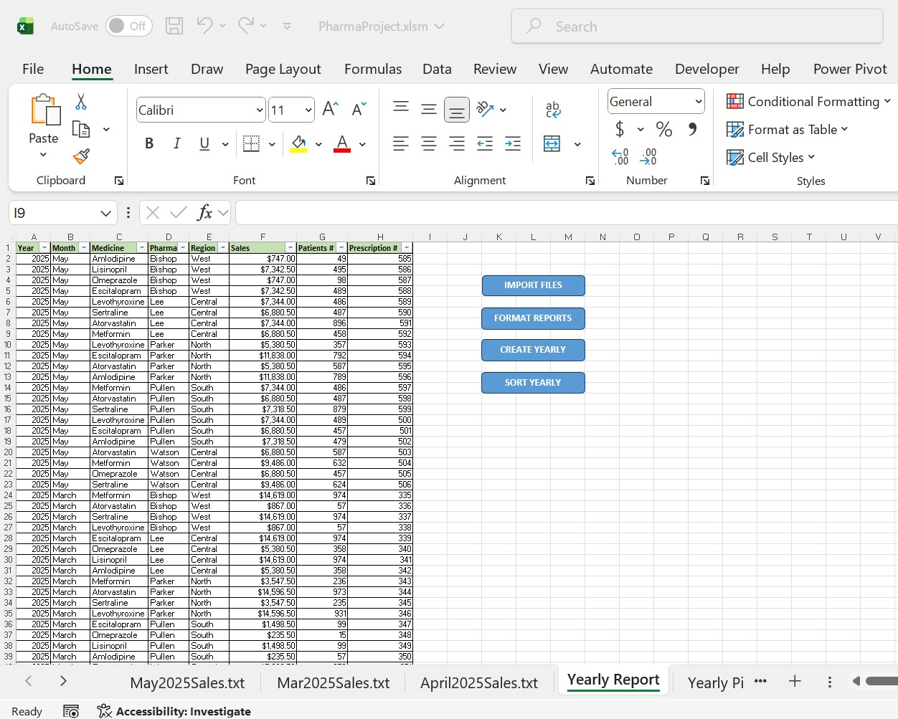
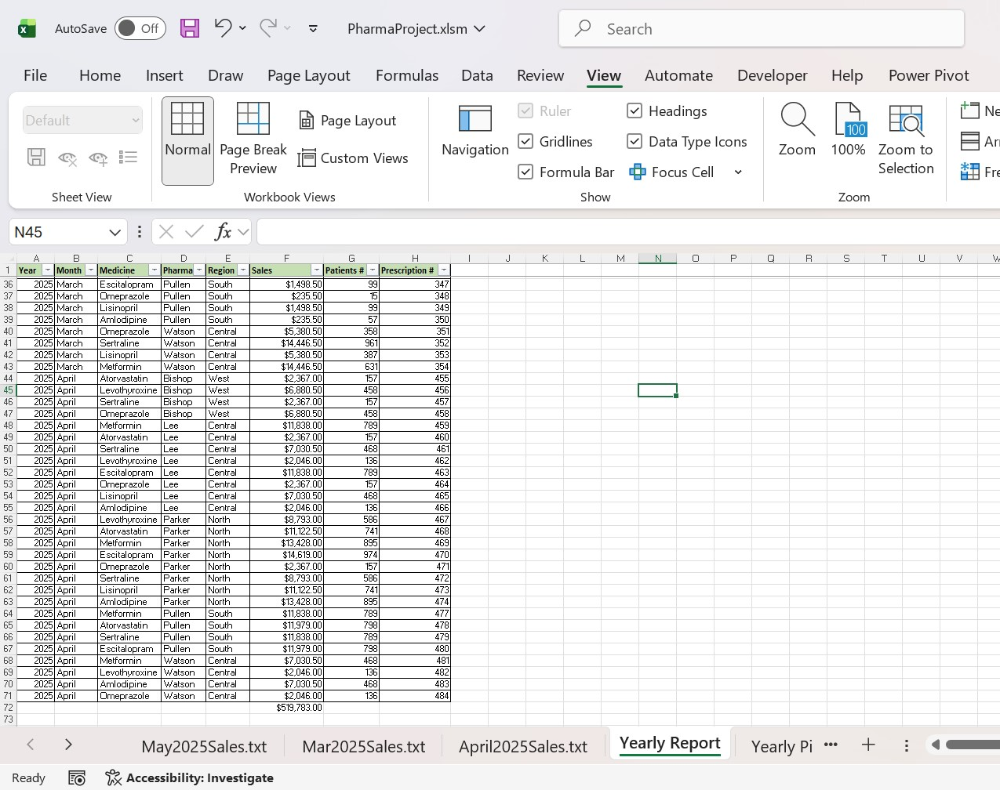
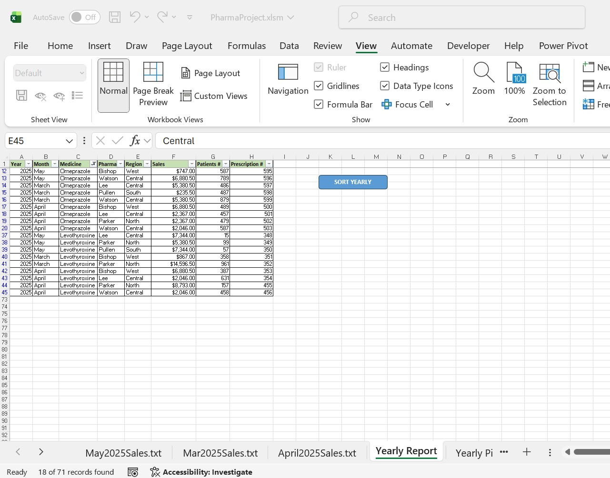
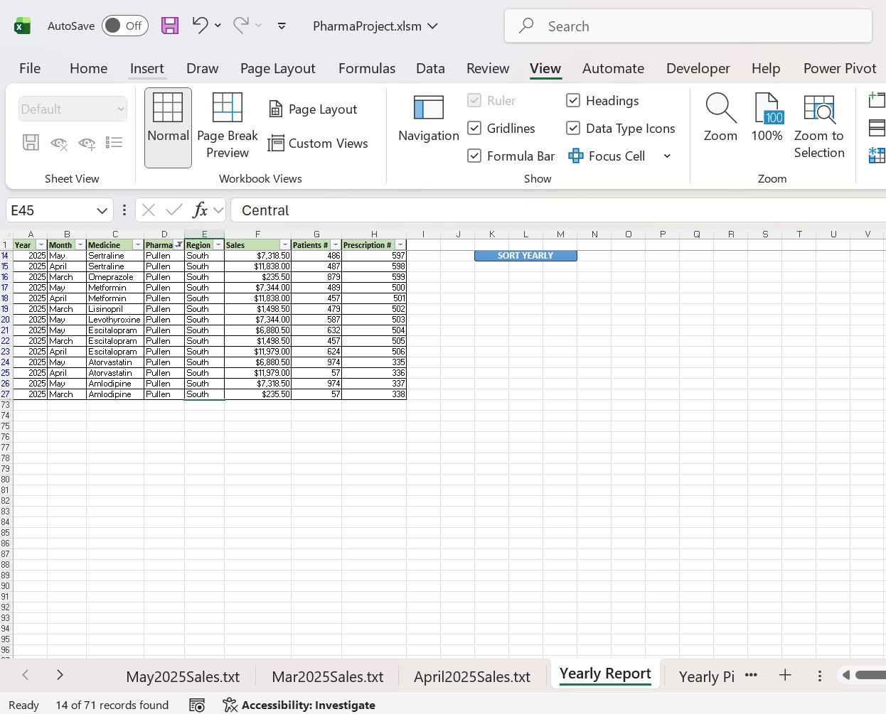
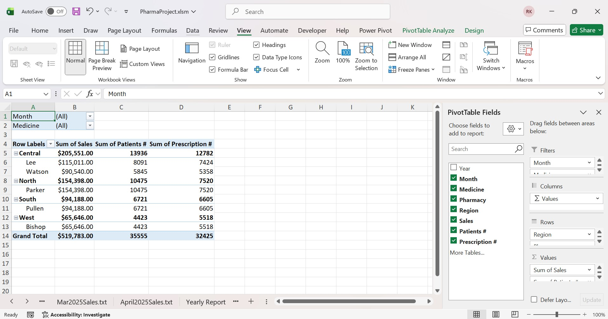
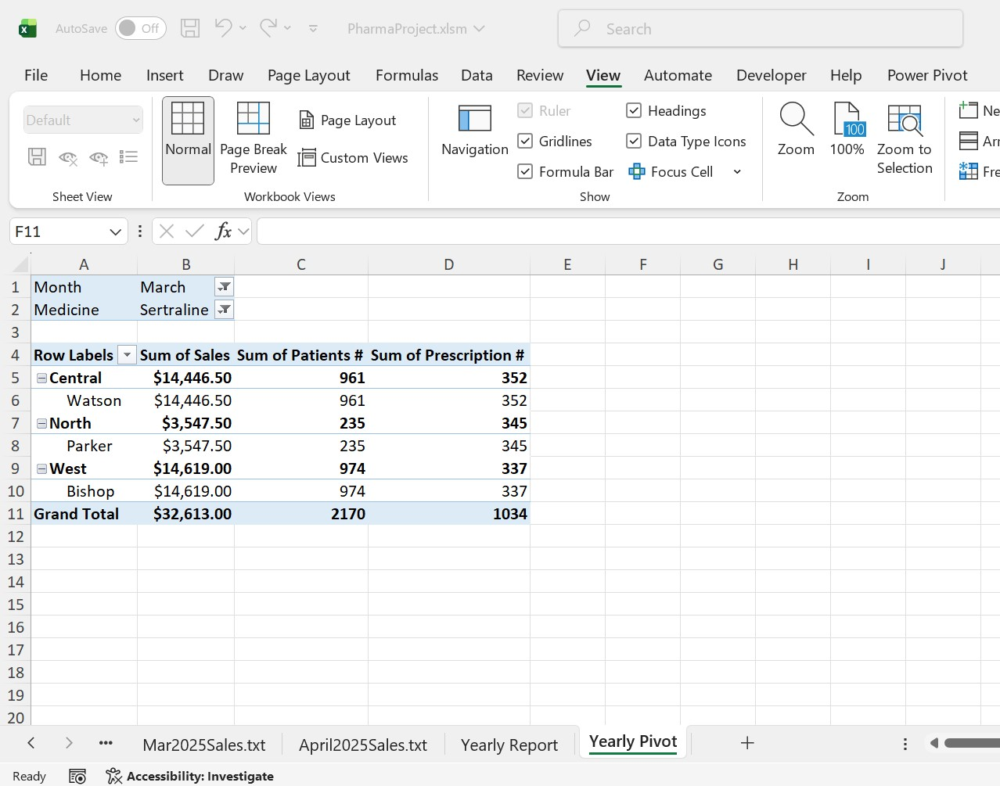
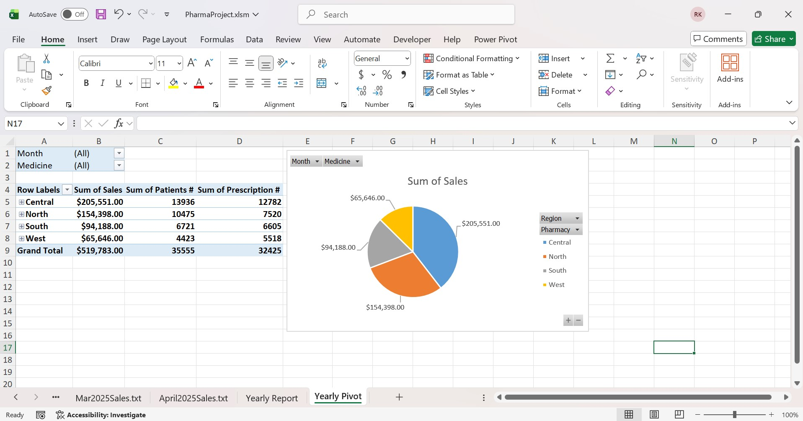

# Pharmaceutical Sales Consolidator - Fully Automated Excel + VBA Tool

One Excel file → click 4 buttons → get a perfect yearly sales report with tables, filters, totals and sorting.
Works with any number of monthly *.txt / *.csv files.

## 90-second demo

*(or check on Google Sites → [Remiggio's Portfolio](https://sites.google.com/d/1lHfTdNbgsY0gpKOjvu3efsIz-YKMZ4eK/p/1gX0BanwGgy8FYQehbas53nqUIUTXqpBH/edit?pli=1))*

## Features
- Import unlimited monthly reports (.txt or .csv) in one click
- Automatic table formatting + AutoFilter + Total Sales row (Sales column)
- One-click consolidation of all monthly reports into a clear Yearly Report
- Interactive sorting of the yearly table (choose column 'Month', 'Medicine', 'Pharmacy' or 'Region')
- Ready for manual PivotTable / PivotChart (example included)

## How to use (4 clicks total)
1. Download → 'Pharmaceutical Sales Consolidator.xlsm'
2. Enable macros
3. Click **"IMPORT FILES"** → select all your monthly *.txt/*.csv files
4. Click **"FORMAT REPORTS"** → **"CREATE YEARLY"** → **"SORT YEARLY"**

Done. You have now a perfect, filterable yearly report.

## Folder contents
- 'Pharmaceutical Sales Consolidator.xlsm' → main file (ready to use)
- '/Sample_Data/' → 3 example monthly files (anonymized)
- '/Screenshots/' → ready Yearly Report + example PivotTable + example PivotChart
- 'PharmaProject_Recording.mp4' → 90-second video demonstration

## Example of final resut

## Requirements
- Windows + Microsoft Excel 2016 or newer (macros must be enabled)

## License
MIT - feel free to use, modify and share in your company or with friends.

Created by Remiggio - 2025
